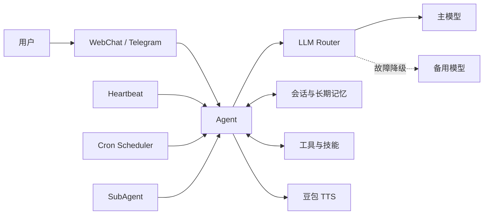

# ClawSpeaker

一个可本地运行、支持多模型与多渠道接入的 Python AI 助手。

ClawSpeaker 将大语言模型、工具调用、会话记忆、定时任务、子代理和语音合成整合在同一个异步运行时中。项目目前提供内置 WebChat，可选接入 Telegram，并通过 OpenAI 兼容接口连接 DeepSeek、OpenAI 或其他兼容服务。

> 项目仍处于开发阶段，配置格式和接口可能继续调整。

## 功能特性

- **多模型接入**：支持 OpenAI 兼容 API，可配置主模型和多个故障降级模型。
- **工具调用**：内置文件读写、命令执行、浏览器访问和消息类工具，并提供基础安全策略。
- **会话记忆**：会话自动保存到本地，支持上下文压缩、关键词检索和可选语义检索。
- **多渠道交互**：自带 WebChat，支持可选的 Telegram Bot 接入。
- **后台能力**：内置心跳循环、Cron 定时任务和子代理任务管理。
- **语音合成**：集成豆包 TTS，支持带 `<mood>` 标签的分段情绪语音和 MP3 拼接。
- **技能扩展**：可从工作区 `skills` 目录加载基于 `SKILL.md` 的自定义技能。

## 运行架构



## 环境要求

- Python 3.10 或更高版本
- 一个支持 OpenAI Chat Completions 接口的模型服务及 API Key
- 可选：Telegram Bot Token
- 可选：豆包语音合成 API Key

## 快速开始

### 1. 克隆项目

```bash
git clone https://github.com/zmiao4959-oss/clawspeaker.git
cd clawspeaker
```

### 2. 创建虚拟环境

```bash
python -m venv .venv
```

Windows PowerShell：

```powershell
.\.venv\Scripts\Activate.ps1
```

macOS / Linux：

```bash
source .venv/bin/activate
```

### 3. 安装依赖

当前代码运行所需的完整依赖可按下面的命令安装：

```bash
pip install openai python-dotenv PyYAML fastapi uvicorn websockets croniter requests "python-telegram-bot>=21,<22"
```

如果只需要测试豆包实时语音示例，还需要安装 `pyaudio`。

### 4. 配置模型

ClawSpeaker 默认读取：

```text
~/.clawspeaker/config.yaml
```

先创建 `~/.clawspeaker` 目录，再写入以下配置：

```yaml
llm:
  provider: deepseek
  model: deepseek-chat
  base_url: https://api.deepseek.com/v1
  temperature: 0.7
  max_tokens: 4096

  # 可选：主模型不可用时按顺序尝试
  fallback_providers: []
  # fallback_providers:
  #   - provider: openai
  #     model: gpt-4o-mini
  #     base_url: https://api.openai.com/v1
  #     api_key: ""

gateway:
  host: 127.0.0.1
  port: 18789
  auth_token: ""

agent:
  max_tool_rounds: 15
  max_context_tokens: 80000
  compaction_keep_messages: 20
  heartbeat_interval_min: 30
  thinking: adaptive

channels:
  enabled:
    webchat: true
    telegram: false
    wechat: false
  settings:
    telegram:
      bot_token: ""
```

推荐通过环境变量或项目根目录下的 `.env` 文件提供密钥，不要把真实密钥写入 Git：

```dotenv
CLAWSPEAKER_API_KEY=your_llm_api_key
CLAWSPEAKER_AUTH_TOKEN=your_gateway_token
```

如果想把运行数据保存到其他位置，可设置：

```dotenv
CLAWSPEAKER_WORKSPACE=/path/to/workspace
```

主配置文件始终位于工作区的上一级目录。例如 `CLAWSPEAKER_WORKSPACE=/data/clawspeaker/workspace` 时，配置文件路径为 `/data/clawspeaker/config.yaml`。

### 5. 启动

```bash
python main.py
```

启动完成后访问：

- WebChat：<http://127.0.0.1:8000>
- WebSocket Gateway：`ws://127.0.0.1:18789`

按 `Ctrl+C` 可停止服务，程序会依次关闭渠道、心跳、定时任务和 Gateway。

## 可选配置

### Telegram

在 `config.yaml` 中启用 Telegram，并填入 Bot Token：

```yaml
channels:
  enabled:
    webchat: true
    telegram: true
  settings:
    telegram:
      bot_token: your_telegram_bot_token
```

### 豆包 TTS

在 `clawspeaker/.env` 中配置语音服务：

```dotenv
CLAWSPEAKER_TTS_API_KEY=your_tts_api_key
CLAWSPEAKER_TTS_RESOURCE_ID=seed-tts-2.0
CLAWSPEAKER_TTS_SPEAKER=zh_female_vv_uranus_bigtts
CLAWSPEAKER_TTS_UID=clawspeaker
CLAWSPEAKER_WEBCHAT_TTS=1
```

其他可选变量：

| 变量 | 默认值 | 说明 |
| --- | --- | --- |
| `CLAWSPEAKER_TTS_URL` | 豆包 WebSocket 地址 | 自定义 TTS 服务地址 |
| `CLAWSPEAKER_TTS_MERGE_SAME_MOOD` | `1` | 合并相邻且情绪相同的文本段 |
| `CLAWSPEAKER_TTS_USE_SECTION_ID` | `1` | 复用语音会话 section ID |
| `CLAWSPEAKER_TTS_DISABLE_MARKDOWN_FILTER` | `1` | 合成前过滤 Markdown 内容 |

可运行本地示例验证 TTS：

```bash
python test_doubao.py
```

生成的音频默认写入 `output.mp3`。

## 工作区目录

ClawSpeaker 默认使用 `~/.clawspeaker/workspace` 保存运行数据：

```text
~/.clawspeaker/
├── config.yaml          # 主配置
└── workspace/
    ├── sessions/        # 会话记录
    ├── skills/          # 自定义技能
    └── ...              # 记忆及其他运行数据
```

技能目录结构示例：

```text
skills/
└── example-skill/
    └── SKILL.md
```

## 项目结构

```text
clawspeaker/
├── main.py                       # 程序入口与组件编排
├── clawspeaker/
│   ├── agent.py                  # Agent 主循环与工具调用
│   ├── config.py                 # 配置加载
│   ├── gateway/                  # WebSocket Gateway
│   ├── channels/                 # WebChat / Telegram / 微信适配层
│   ├── llm/                      # LLM 接口、Provider 与故障降级路由
│   ├── memory/                   # 会话、文件记忆与检索
│   ├── skills/                   # 技能发现与加载
│   ├── tools/                    # 内置工具及注册表
│   ├── tts/                      # 豆包语音合成
│   ├── cron_scheduler.py         # Cron 定时任务
│   ├── heartbeat.py              # 周期心跳
│   ├── security.py               # 工具安全策略
│   └── subagent.py               # 子代理任务管理
├── test_doubao.py                # TTS 合成示例
└── test_doubao_predict.py        # 实时语音示例
```

## 开发检查

可以先运行 Python 编译检查，确认源码不存在语法错误：

```bash
python -m compileall main.py clawspeaker
```

## 安全提示

- 不要提交 `.env`、API Key、Bot Token 或其他真实凭据。
- Gateway 或 WebChat 对外网开放前，请先增加可靠的访问控制和反向代理配置。
- 命令执行和文件写入工具具有较高权限，公开部署时应收紧允许访问的目录与网络范围。
- 如果密钥曾被提交到 Git 历史，请先撤销并重新生成密钥，仅删除当前文件中的值并不安全。

## Roadmap

- [ ] 补充自动化测试与 CI
- [ ] 完善微信渠道适配
- [ ] 完善依赖声明与一键安装
- [ ] 增强 Gateway / WebChat 的鉴权与部署文档
- [ ] 提供更多内置技能与工具

## License

当前仓库尚未添加开源许可证。若计划公开发布并允许他人使用、修改或分发，请在同步到 GitHub 前补充合适的 `LICENSE` 文件。
